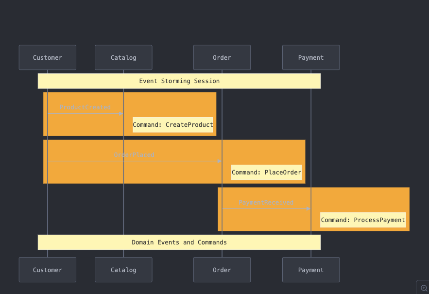

# E-Ticaret DDD kata 

## 📋 İçerik Tablosu
- [Event Storming Süreci](#event-storming-süreci)
- [Domain Model Analizi](#domain-model-analizi)
- [Taktiksel Tasarım Kararları](#taktiksel-tasarım-kararları)
- [Implementasyon Detayları](#implementasyon-detayları)

## Event Storming Süreci

### 👥 Workshop Katılımcıları

| Rol                 | İsim     | Sorumluluk        |
|---------------------|----------|-------------------|
| 👨‍💼 Moderatör     | Taner    | Workshop Yönetimi |
| 👨‍💻 Domain Expert | Enes     | İş Süreçleri      |
| 👩‍💻 Developer     | Kübra    | Yazılımcı         |
| 👨‍💻 Developer     | Fırat    | Yazılımcı         |
| 👨‍💻 Developer     |  ECK | Yazılımcı         |

### 📊 Domain Event Keşfi
### 🎯 Event Analizi

**Moderatör**: "Merhaba ekip, bugün e-ticaret sistemimizin domain modelini çıkaracağız."

1. **ProductCreated Event'i**
   - Tetikleyici: Yeni ürün ekleme isteği
   - Command: CreateProduct
   - Business Rule: Ürün ismi ve fiyatı zorunlu

2. **OrderPlaced Event'i**
   - Tetikleyici: Sipariş oluşturma isteği
   - Command: PlaceOrder
   - Business Rule: Stok kontrolü

3. **PaymentReceived Event'i**
   - Tetikleyici: Ödeme işlemi
   - Command: ProcessPayment
   - Business Rule: Ödeme tutarı kontrolü

---

## Domain Model Analizi

### 🏗️ Bounded Context'ler

### 📦 Context Sorumlulukları

#### Catalog Context
- Ürün yaşam döngüsü yönetimi
- Kategori organizasyonu
- Ürün arama ve filtreleme
- Stok yönetimi

#### Order Context
- Sipariş oluşturma ve yönetimi
- Sepet işlemleri
- Sipariş durumu takibi
- Teslimat bilgileri yönetimi

#### Payment Context
- Ödeme işlemleri
- İade süreçleri
- Transaction kayıtları
- Fatura oluşturma

## Taktiksel Tasarım Kararları

### 🎯 Aggregate Seçim Kriterleri

1. **Catalog Context Analizi:**
   
   Product Aggregate Root seçim kriterleri:
   - Fiyat Değişimi
   - Stok Güncelleme
   - Ürün Detay Değişimi
   
   Category Aggregate Root seçim kriterleri:
   - İsim Değişimi
   - Alt Kategori Yönetimi
   - Kategori Sıralaması

2. **Order Context Analizi:**
   
   Order Aggregate Root içeriği:
   - OrderItems yönetimi
   - Sipariş Durumu kontrolü
   - Toplam Tutar hesaplaması
   
   OrderItem Entity bağımlılıkları:
   - Order Aggregate'e bağlı yaşam döngüsü

3. **Payment Context Analizi:**
   
   Payment Aggregate Root içeriği:
   - Transactions yönetimi
   - Ödeme Durumu kontrolü
   - Ödeme Tutarı doğrulaması
   
   Transaction Entity bağımlılıkları:
   - Payment Aggregate'e bağlı yaşam döngüsü

### 📋 Tasarım Kararları ve Gerekçeleri

#### Aggregate Root Seçimleri:

1. **Product as Aggregate Root**
   - ✅ Kendi yaşam döngüsüne sahip
   - ✅ İş kuralları bütünlüğü sağlar
   - ✅ Stok ve fiyat tutarlılığını kontrol eder

2. **Order as Aggregate Root**
   - ✅ Sipariş bütünlüğünü korur
   - ✅ OrderItem'ları yönetir
   - ✅ Toplam tutarı hesaplar

3. **Payment as Aggregate Root**
   - ✅ Ödeme tutarlılığını sağlar
   - ✅ Transaction'ları yönetir
   - ✅ İade süreçlerini kontrol eder

#### Entity Seçimleri:

1. **OrderItem as Entity**
   - ❗ Order'a bağımlı yaşam döngüsü
   - ❗ Tek başına anlam ifade etmez
   - ❗ Order context'i içinde kalır

2. **Transaction as Entity**
   - ❗ Payment'a bağımlı
   - ❗ Ödeme ile birlikte yönetilmeli
   - ❗ Bağımsız değiştirilemez
---